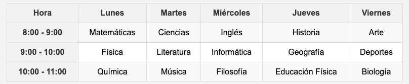
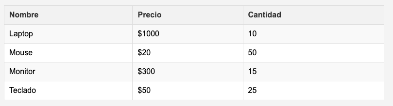
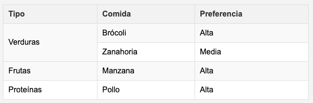
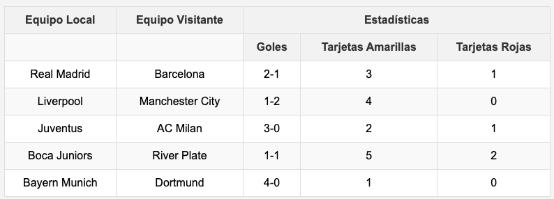
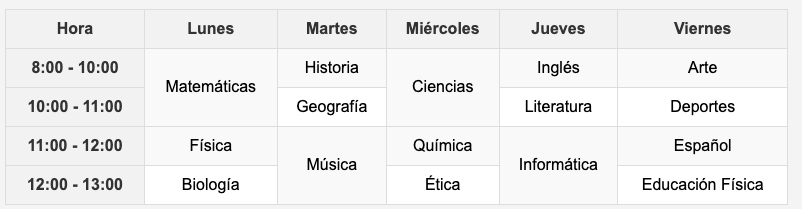

# Practica de tablas 

## Ejercicio 1: Tabla de Horario
```
Crea una tabla que muestre un horario semanal simple para un estudiante. Incluye días de la semana y asignaturas.

➖ Usa <th> para encabezados de días y horas.
➖ Añade al menos 3 filas para horas y asignaturas.
```
Ejemplo


## Ejercicio 2: Tabla de Productos
```
Crea una tabla de productos con columnas para nombre, precio y cantidad. Agrega 4 filas de datos.

➖ Incluye un encabezado para la tabla usando <th>.
➖ Usa <td> para cada dato.
```
Ejemplo


## Ejercicio 3: Tabla con Fusión de Celdas (Rowspan)
```
Crea una tabla de preferencias de comida, fusionando filas para categorías compartidas.

➖ Usa rowspan en una celda para combinar 2 filas en la columna de "Tipo".
➖ Ejemplo: Una celda "Vegetales" que ocupe 2 filas.
```
Ejemplo


## Ejercicio 4: Tabla con Fusión de Columnas (Colspan)
```
Crea una tabla de resultados de partidos deportivos con encabezados fusionados.

➖ Usa colspan para fusionar columnas bajo "Estadísticas".
➖ Añade datos para 3 partidos.
```

## Ejercicio 5 : Tabla Compleja (Horario Avanzado)
```
Crea un horario de clases fusionando celdas para bloques de tiempo y días.

Combina rowspan y colspan para clases que duran más tiempo.
Ejemplo: Matemáticas ocupa 2 horas (2 filas)
```
